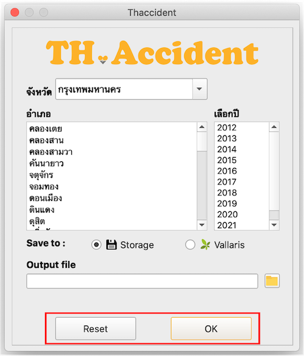

TH.Accident   
===

TH.Accident เป็นปลั๊กอินที่ให้บริการดาวน์โหลดจุดเกิดอุบัติเหตุในประเทศไทย ข้อมูลจาก http://bhs.doh.go.th (สำนักอำนวยความปลอดภัย กรมทางหลวง)

วิธีใช้งาน
---

**1. Select Item**

  * เลือกจังหวัด
  * เลือกอำเภอ (สามารถเลือกได้หลายอำเภอ)
  * เลือกปี (สามารถเลือกได้หลายปี)

    

**2. Save to**

  * เลือกที่เก็บข้อมูล Storage 
    * เลือกโฟล์เดอร์ และตั้งชื่อไฟล์
    
    

    

    * เลือก type ของข้อมูล
        1. CSV file(*.csv)
        2. Shapefiles(*.shp)
        3. GeoJSON(*.geojson)

    
    
  * ผลลัพธ์

    

   
  * แพลตฟอร์ม Vallaris
    * ใส่ API-Key
    * ใส่ Collection ID
  
    

  * ผลลัพธ์

    

**3. OK และ Reset**

  * กด OK เพื่อ save หรือ กด Reset เพื่อ reset ข้อมูลที่เลือกไว้
  
    

  

